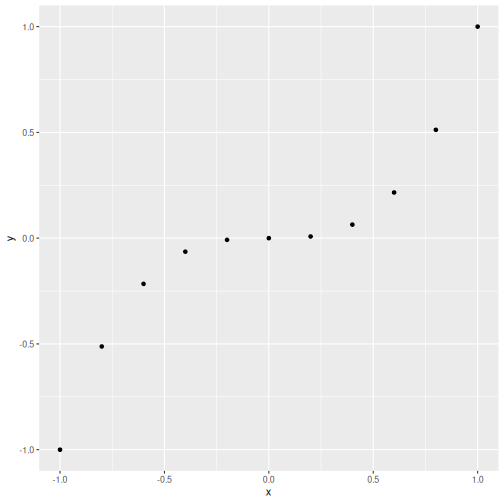
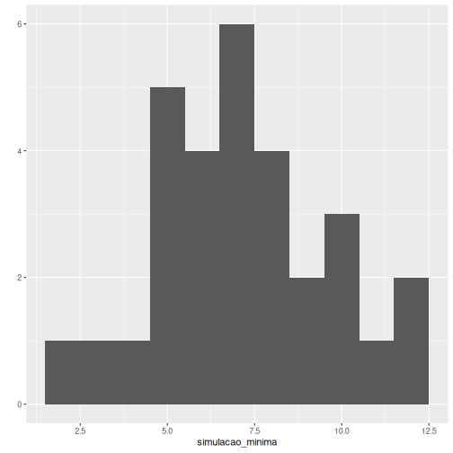
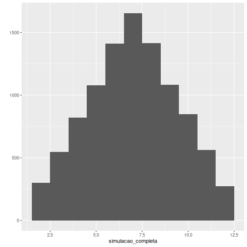
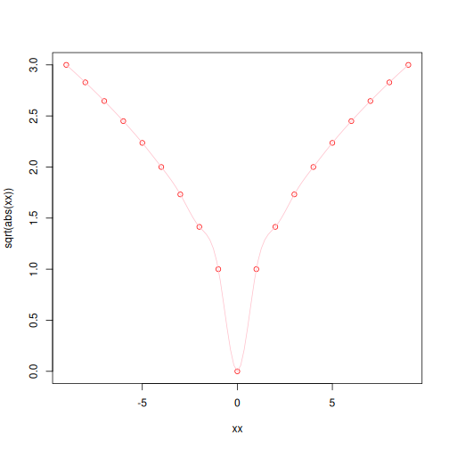
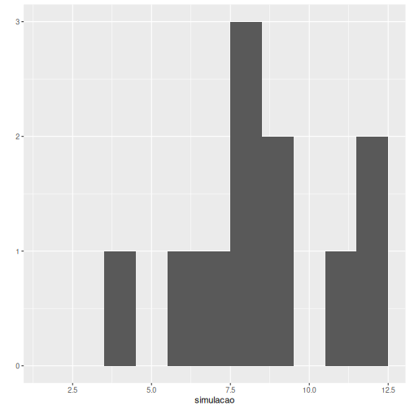

``` r
# Funcoes graficas com ggplot2
library(ggplot2)
# Instalacao do pacote (execute se necessario)
#install.packages("ggplot2")
```


``` r
# Sequencia de valores para o grafico
x <- c(-1, -0.8, -0.6, -0.4, -0.2, 0, 0.2, 0.4, 0.6, 0.8, 1)
x
```

```
##  [1] -1.0 -0.8 -0.6 -0.4 -0.2  0.0  0.2  0.4  0.6  0.8  1.0
```

``` r
# Transformacao e visualizacao
y <- x^3
y
```

```
##  [1] -1.000 -0.512 -0.216 -0.064 -0.008  0.000  0.008  0.064  0.216  0.512  1.000
```

``` r
qplot(x, y)
```




``` r
# Simulacao simples de dois dados
dado <- 1:6
dados <- sample(dado, size = 2, replace = TRUE)
sum(dados)
```

```
## [1] 8
```


``` r
# Funcao que retorna a soma dos dados
jogada <-  function() {
  dado <- 1:6
  dados <- sample(dado, size = 2, replace = TRUE)
  return(sum(dados))
}
```


``` r
# Simulacao pequena para visualizar a distribuicao
simulacao_minima <- replicate(30, jogada())
qplot(simulacao_minima, binwidth =1)
```



``` r
mean(simulacao_minima)
```

```
## [1] 7.166667
```


``` r
# Simulacao completa para estimar a media
simulacao_completa <- replicate(10000, jogada())
qplot(simulacao_completa, binwidth =1)
```



``` r
mean(simulacao_completa)
```

```
## [1] 7.0029
```


``` r
# Ajuda da funcao sqrt
?sqrt
```


``` r
# Exemplo de spline e grafico com sqrt
require(stats) # for spline
require(graphics)
xx <- -9:9
plot(xx, sqrt(abs(xx)),  col = "red")
lines(spline(xx, sqrt(abs(xx)), n=101), col = "pink")
```




``` r
# Simulacao da soma de dois dados com probabilidades
simulacao = replicate(10000, 
                      sample(2:12, 
                      replace=TRUE, 
                      prob=c(1,2,3,4,5,6,5,4,3,2,1)/36))
qplot(simulacao, binwidth=1)
```

```
## Warning in `[<-.data.frame`(`*tmp*`, , x_vars, value = list(x = c(4, 8, : replacement element 1 has 110000 rows to replace 11
## rows
```



``` r
mean(simulacao)
```

```
## [1] 7.000027
```
